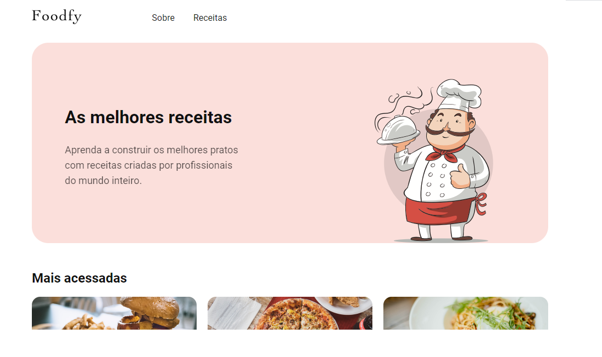
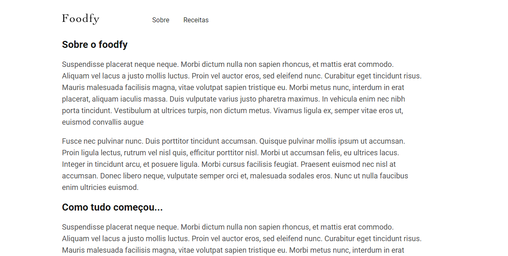
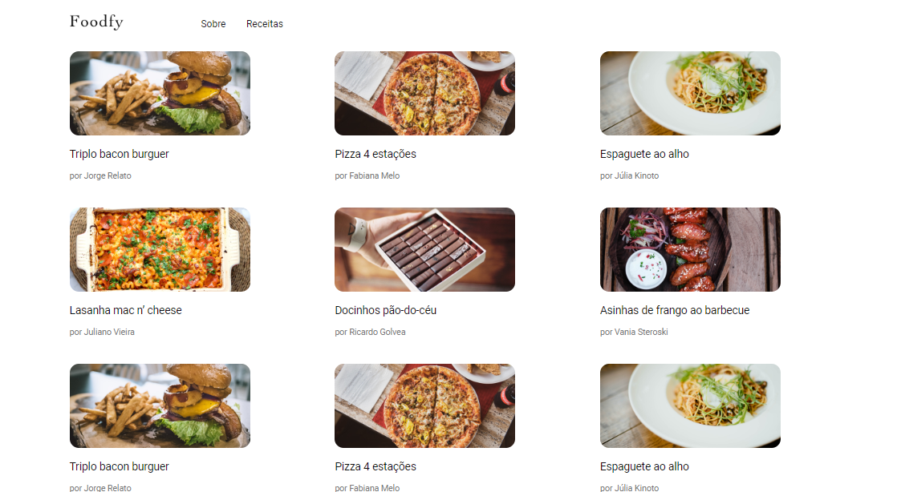
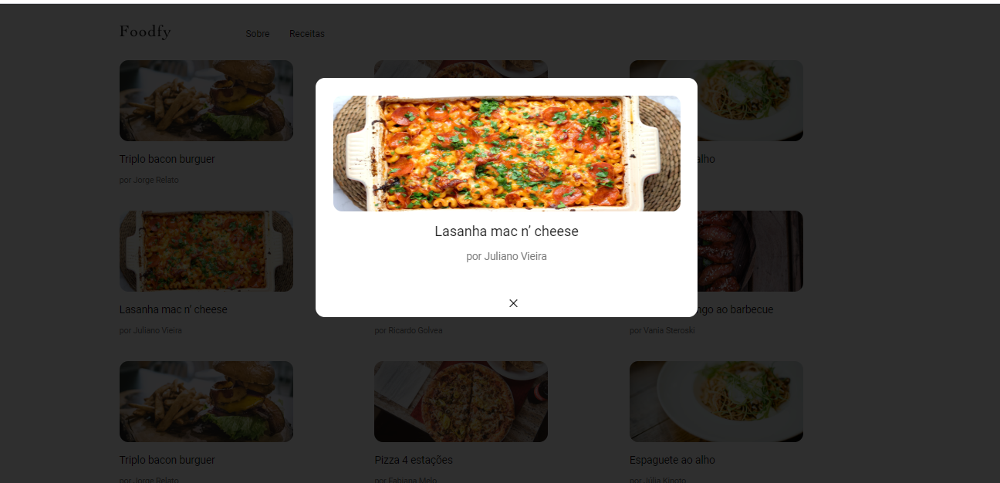

<h1 align="center">Foodfy<h1>

---
## Índice
- [Sobre](#-sobre)
- [Telas](#-telas)
- [Tecnologias](#-tecnologias)
- [Produção](#-produção)

---
### Sobre
Desafio proposto no LaunchBase da [Rocketseat](https://rocketseat.com.br/). A ideia consistia em desenvolver o front-end de um site para uma empresa de receitas com nome de Foodfy.

---
### Telas

🍕 A tela inicial continha a logo da empresa, menu com links para duas outras páginas: Sobre e Receitas.

🍟 A segunda tela era sobre a empresa.

🥓 A terceira e última tela consistia nas Receitas

e ao clicar em uma das receitas aparecia um modal com a receita em foco.

---
### Tecnologias

Foram utilizadas as seguintes ferramentas:
- HTML
- CSS
- Javascript

---
### Produção
Projeto desenvolvido por Camila Almeida Diniz.
 
Durante a realização do LaunchBase da [Rockeseat](https://rocketseat.com.br/)